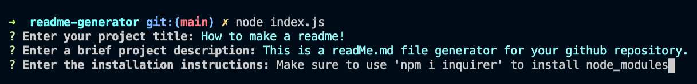

 &nbsp;
 &nbsp;
 &nbsp;

# lkj
## Description
>lkj
  
## Table of Contents
>1. [Title](#Title)
2. [Description](#Description)
3. [Installation](#Installation)
4. [Usage](#Usage)
5. [License](#License)
6. [Contributing](#Contributing)
7. [Tests](#Tests)
8. [Questions?](#Questions?)
  
## Installation
>1. Be sure you've installed npm (node project manager) and node.js on your system.  
2. On your terminal command line, enter 'npm i inquirer'. This will ensure the correct node_module is installed. 
3. To run the generator, enter 'node index.js' ... then just start answering the questions!   
  
## Usage
>Simply answer each question as they appear and press 'Enter' to proceed to the next question.

  
## License 
>This application is covered under the [GPLv3 License](https://opensource.org/licenses/GPLv3)
  
## Contributing
>lkj

## Tests
>lkj
  
## Questions?
>Please direct all questions to:
lkj 
Check out my [GitHub Profile] (https://github.com/lkj) 
    